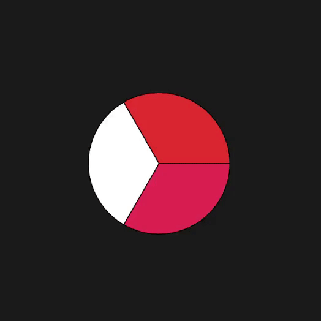

# PieChartSwiftUI
Simple pie chart built in Swift &amp; SwiftUI

<p align="center">  

  
  
  
  
  
  
</p>

## Installation

### CocoaPods
[CocoaPods](https://cocoapods.org) is a dependency manager for Cocoa projects. To integrate PieChartSwiftUI into your project using CocoaPods, specify it in your `Podfile`:

```ruby
pod 'PieChartSwiftUI', '~> 1.0.0'
```
After that use `pod install` command in your terminal.

### Carthage
[Carthage](https://github.com/Carthage/Carthage) is a decentralized dependency manager that builds your dependencies and provides you with binary frameworks. To integrate PieChartSwiftUI into your Xcode project using Carthage, specify it in your `Cartfile`:

```ogdl
github "IrelDev/PieChartSwiftUI"
```
After that use `carthage update` command in your terminal.

### Manually
If you prefer not to use any dependency managers, you can integrate PieChartSwiftUI into your project manually by copying `Sources` directory.

## Usage
PieChartSwiftUI allows you to create pie charts from unique slices with custom colors, as well as create pie charts based on data array.

To create unique pie slice use `PieChartItemModel` and create `PCItems` from a `PieChartItemModel` array.
```swift
let firstItem = PieChartItemModel(value: 25, color: .pink)
let secondItem = PieChartItemModel(value: 25, color: .white)
let thirdItem = PieChartItemModel(value: 25, color: .red)

let items = PCItems(items: [firstItem, secondItem, thirdItem])
```

To create pie chart based on data array use `PCItems` with the data: [Double] initializer.
```swift
let items = PCItems(data: [25, 25, 25], chartColor: .black)
```

To create a PieChartView, use one of the `PieChartView` initializers.
```swift
PieChartView(items: items, sliceSeparatorColor: .black)
.frame(width: 150, height: 150, alignment: .center)
```

## License
PieChartSwiftUI is available under the MIT license, see the [LICENSE](LICENSE) file for more information.
